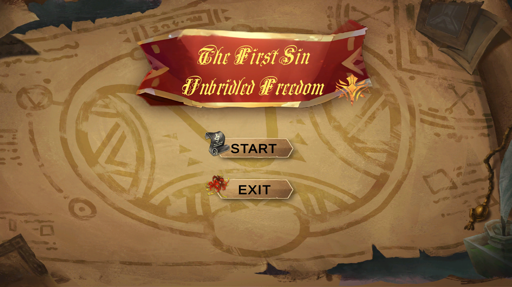
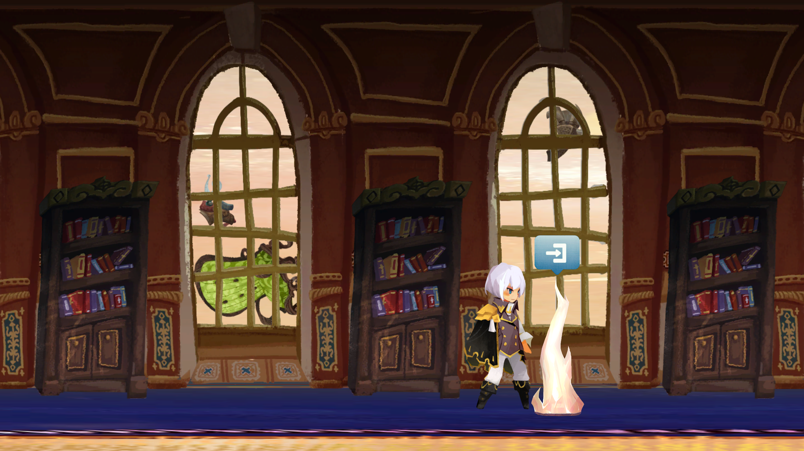
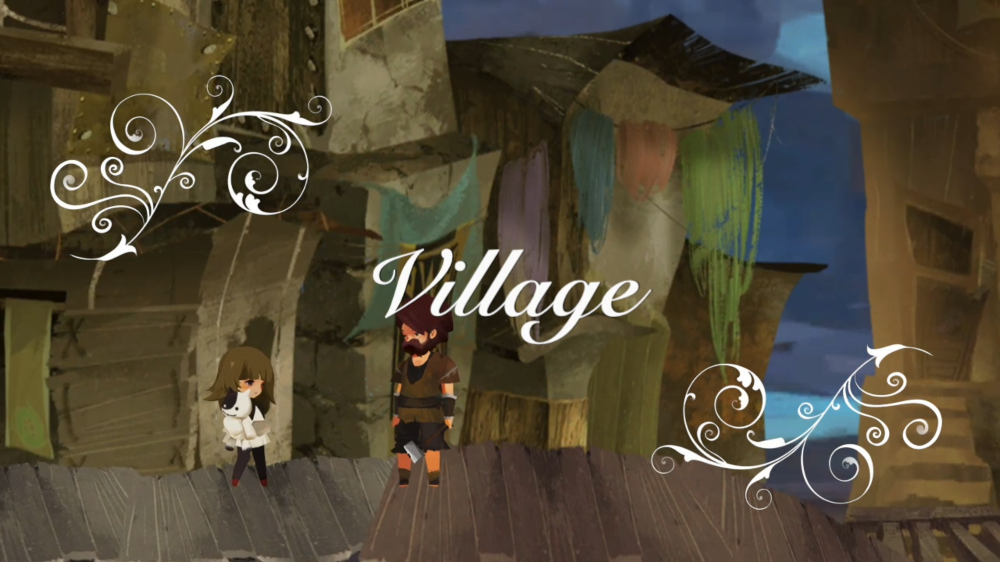
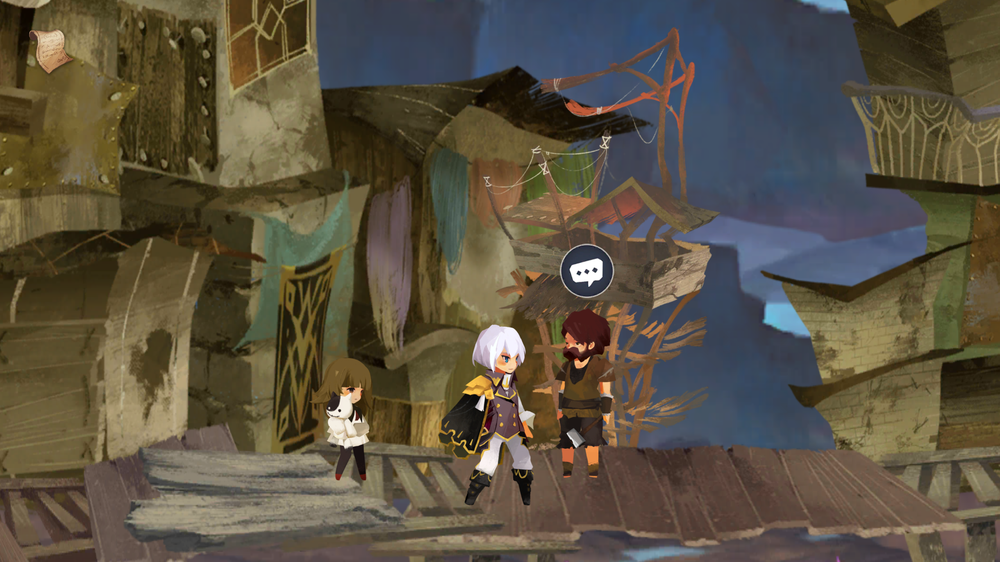
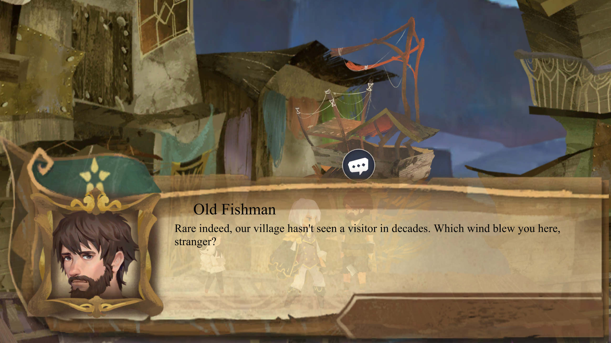
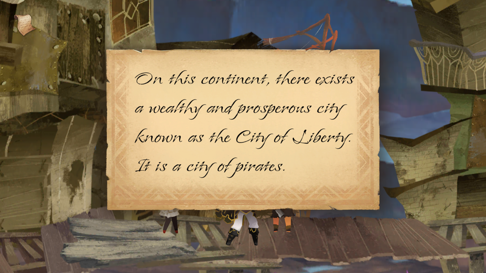

# The First Sin: Unbridled Freedom

A story-driven adventure game where players play the role of a mage who receives a commission from the Great Library to find clues to the first crime and restore the whole picture of the incident. 

## Keyboard binding

Players can use A & D keys to move the character. Hold left SHIFT to run. Press the E key to interact with items or NPCs. Click the left mouse button to read the dialogue or make a decision.

| Function             | Key                      |
|----------------------|--------------------------|
| Move left            | `[A]`                    |
| Move right           | `[D]`                    |
| Run                  | `[left SHIFT] (hold)`    |
| Interact (NPCs or items)  | `[E]`               |
| Dialogue             | `[left click]`           |
| Make Decision        | `[left click]`           |

## Gallery

## Link

[Built game](https://drive.google.com/file/d/1qVe644oVSEeSZUZP03JoE6LWc_3q5DLh/view?usp=sharing)

[Game design document](https://docs.google.com/document/d/1NQsBrHWspkhTFnu43fqJgJPE1kl7MZ75618H0L9kqIg/edit?usp=sharing)
